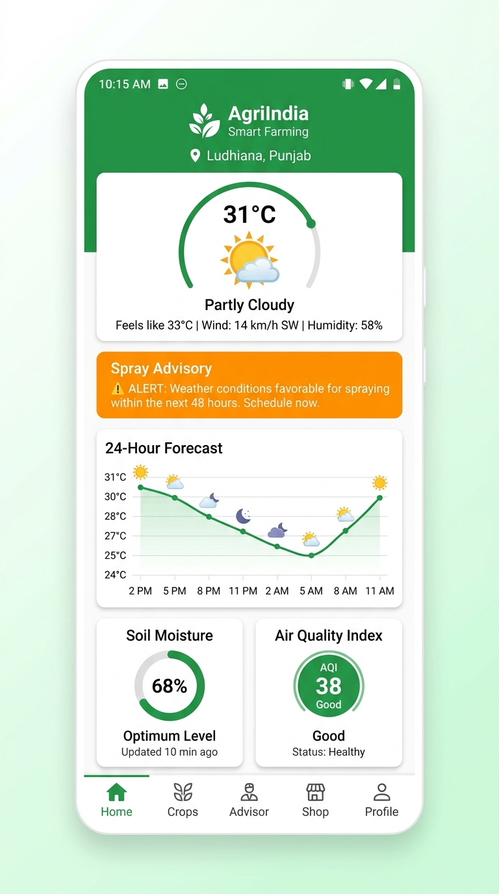
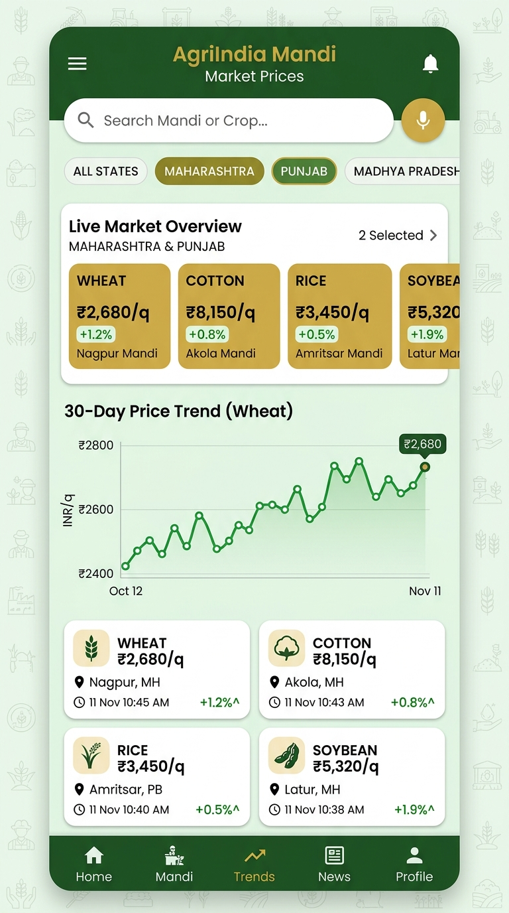
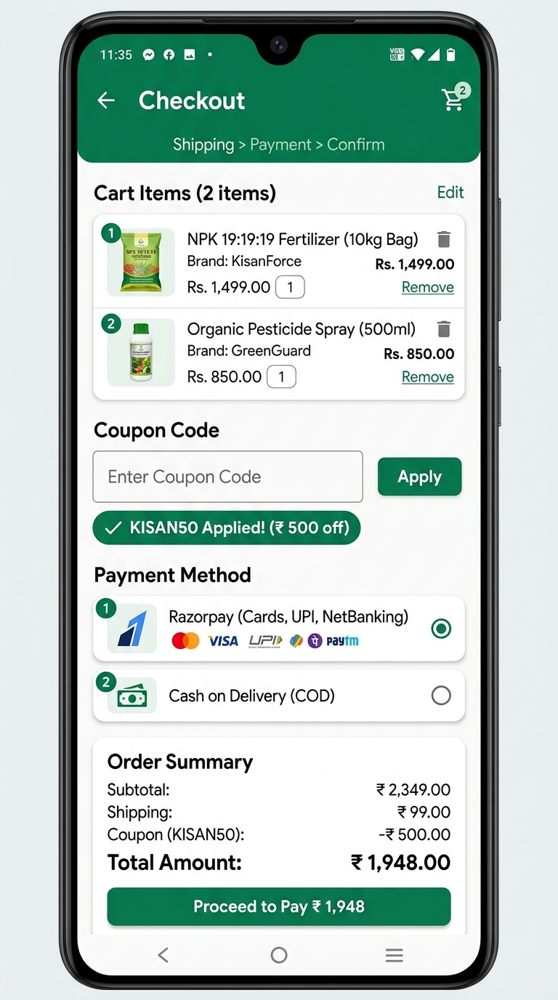
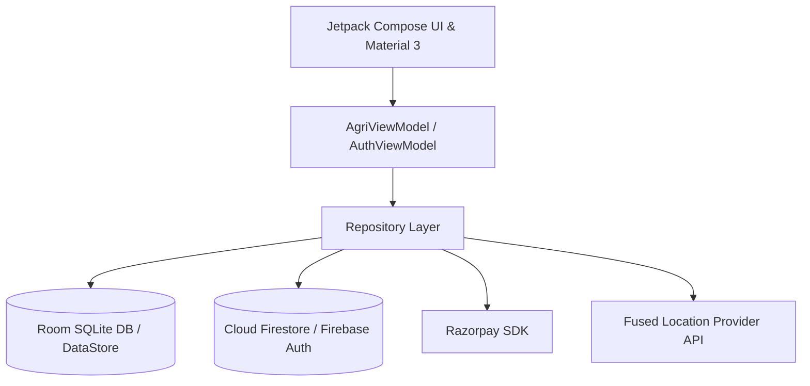

<div align="center">

# 🌾 AgriIndia (AgroIndia)
### Next-Gen Empowering Smart Agriculture Platform for Indian Farmers

[](https://developer.android.com/)
[](https://kotlinlang.org/)
[](https://developer.android.com/jetpack/compose)
[](https://firebase.google.com/)
[](https://razorpay.com/)
[](LICENSE)

*An all-in-one Android application designed to boost crop yields, deliver real-time mandi prices, assist with government scheme subsidies, and provide multilingual AI advice to farmers across India.*

---

[Features](#-key-features) • [Screenshots & UI](#-user-interface) • [Architecture](#-tech-stack--architecture) • [Getting Started](#-getting-started) • [Firebase Setup](#-firebase--firestore-setup) • [Payment Gateway](#-payment-gateway-integration)

</div>

---

## 🚀 Key Features

### 🛰️ 1. Live Weather & GPS Satellite Advisory
- **Real-Time GPS Location**: One-tap auto-location detection using Android Fused Location Provider Services.
- **Micro-Climate Agronomy**: Temperature, humidity, wind velocity, atmospheric pressure, air quality index (AQI), and leaf-wetness spray advisories.
- **Hourly & 7-Day Forecast**: Visual forecast charts tailored for crop irrigation and fertilizer application.

### 📊 2. Live Mandi Market Price Intelligence
- **State & Commodity Filters**: Monitor live crop prices across major mandis in Maharashtra, Punjab, Uttar Pradesh, Gujarat, and Rajasthan.
- **Interactive Price Graphs**: 30-day interactive price history trend visualization for optimal crop selling decisions.
- **Voice Search**: Hands-free voice querying for Mandi prices in native regional accents.

### 📜 3. Government Scheme (Yojna) Hub & Subsidy Calculator
- **PM-Kisan & Fasal Bima Yojna**: Comprehensive database of active state and central agricultural schemes with eligibility criteria.
- **Interactive Subsidy Calculator**: Real-time calculator to estimate financial aid and premium discounts based on land size (Acres).

### 🛒 4. Agri-Bazaar E-Commerce Marketplace
- **Quality Inputs**: Direct purchasing of certified seeds, organic fertilizers, pesticides, and modern farm equipment.
- **Integrated Payment Gateway**: Seamless checkout with **Razorpay SDK** (UPI, Google Pay, PhonePe, Cards, NetBanking) and **Cash on Delivery (COD)** fallback.

### 🗣️ 5. Multilingual AI Assistant (Kisan Mitra)
- **Triple Language Support**: Complete localization in **English**, **Hindi (हिंदी)**, and **Marathi (मराठी)**.
- **AI Voice Query**: Ask farming questions, diagnose crop diseases, and get instant localized advice.

### 💬 6. Cloud Community Forum
- **Farmer Community**: Real-time community feed backed by **Google Cloud Firestore**.
- **Post & Share**: Share agricultural tips, ask questions, and upload field updates with offline Room database caching.

---

## 📱 Application Screenshots & UI Showcase

<div align="center">
  <table>
    <tr>
      <td align="center"><b>🛰️ Live Weather & Spray Advisory</b></td>
      <td align="center"><b>📊 Mandi Prices & 30-Day Analytics</b></td>
      <td align="center"><b>🛒 Checkout & Razorpay Gateway</b></td>
    </tr>
    <tr>
      <td></td>
      <td></td>
      <td></td>
    </tr>
  </table>
</div>

---

## 🛠️ Tech Stack & Architecture

AgriIndia follows modern Android development best practices based on **Clean Architecture** and **MVVM Pattern**:



| Layer | Technology Used |
| :--- | :--- |
| **Language** | Kotlin 1.9 (100% Modern Kotlin Coroutines & StateFlow) |
| **UI Framework** | Jetpack Compose + Material 3 (Declarative UI) |
| **Architecture** | MVVM (Model-View-ViewModel) + Clean Architecture |
| **Local Persistence** | Room Database (SQLite ORM) + DataStore Preferences |
| **Cloud Backend** | Firebase Auth + Cloud Firestore |
| **Payments** | Razorpay Android SDK (v1.6.33) |
| **Location Services** | Google Play Services Location (v21.1.0) |

---

## 📱 Getting Started

### Prerequisites
- **Android Studio**: Jellyfish / Koala or newer
- **JDK**: Version 17 or higher
- **Android SDK**: API Level 34 (Android 14.0)

### 📥 Installation & Running

1. **Clone the repository**:
   ```bash
   git clone https://github.com/ABhusnar15/Agro-india.git
   cd Agro-india
   ```

2. **Build the Debug APK**:
   ```bash
   ./gradlew assembleDebug
   ```

3. **Install directly on a connected device via USB / ADB**:
   ```bash
   ./gradlew installDebug
   ```

---

<details>
<summary><b>🔥 Click here for Firebase & Firestore Configuration Setup</b></summary>

### Step 1: Add App to Firebase Console
1. Go to [Firebase Console](https://console.firebase.google.com/).
2. Create a project named `AgriIndiaApp`.
3. Register the Android App with package name:
   `com.agriindia.app`

### Step 2: Add `google-services.json`
1. Download `google-services.json` from your Firebase project.
2. Place it in the `app/` root directory:
   `app/google-services.json`

### Step 3: Firestore Security Rules
Set your Firestore rules in **Build > Firestore Database**:
```javascript
rules_version = '2';
service cloud.firestore {
  match /databases/{database}/documents {
    match /community_posts/{docId} {
      allow read, create: if true;
      allow update, delete: if request.auth != null;
    }
  }
}
```
</details>

<details>
<summary><b>💳 Click here for Payment Gateway Setup</b></summary>

### Razorpay Integration
1. Obtain your API Key from the [Razorpay Dashboard](https://dashboard.razorpay.com/).
2. You can set your key in `PaymentRepository.kt` or directly enter your `rzp_test_...` key in the interactive Checkout UI on the app.
3. Supported methods out-of-the-box:
   - **UPI**: Google Pay, PhonePe, Paytm, BHIM
   - **Cards**: Visa, Mastercard, RuPay
   - **NetBanking**: All major Indian Banks
   - **Cash on Delivery**: Offline order placement
</details>

---

## 📁 Repository Structure

```text
AgriIndiaApp/
├── app/
│   ├── src/main/java/com/agriindia/app/
│   │   ├── data/           # Room Database DAOs & Entities
│   │   ├── model/          # Data Models (Weather, Mandi, Yojna, Cart)
│   │   ├── repository/     # Repositories (Agri, Location, Payment)
│   │   ├── ui/
│   │   │   ├── components/ # Reusable Compose UI Components
│   │   │   └── screens/    # Screen Composables (Weather, Mandi, Bazaar, Yojna)
│   │   ├── viewmodel/      # AgriViewModel & AuthViewModel
│   │   └── MainActivity.kt # App Entry Point & Navigation Host
│   └── build.gradle.kts
├── FIREBASE_SETUP.md
└── README.md
```

---

## 🤝 Contributing

Contributions make the open-source community an amazing place to learn, inspire, and create. Any contributions you make are **greatly appreciated**!

1. Fork the Project
2. Create your Feature Branch (`git checkout -b feature/AmazingFeature`)
3. Commit your Changes (`git commit -m 'Add some AmazingFeature'`)
4. Push to the Branch (`git push origin feature/AmazingFeature`)
5. Open a Pull Request

---

<div align="center">

Designed with ❤️ for Indian Farmers.

**[⭐ Star this Repo](https://github.com/ABhusnar15/Agro-india)** if you find it helpful!

</div>
